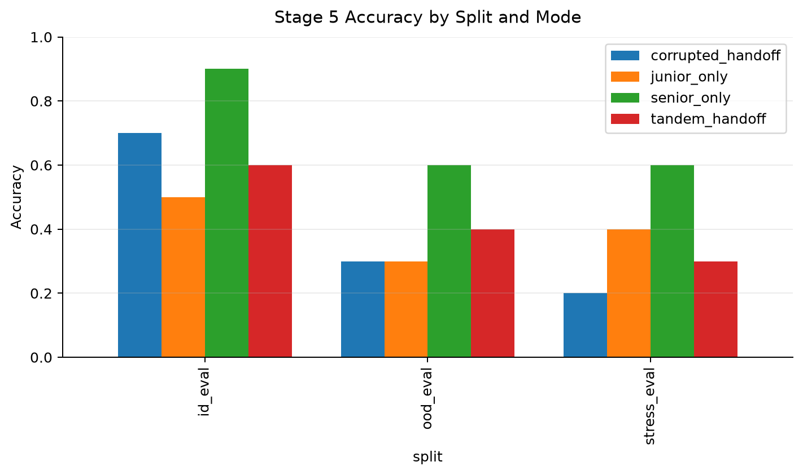
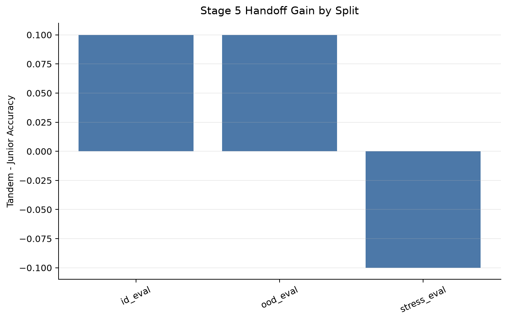
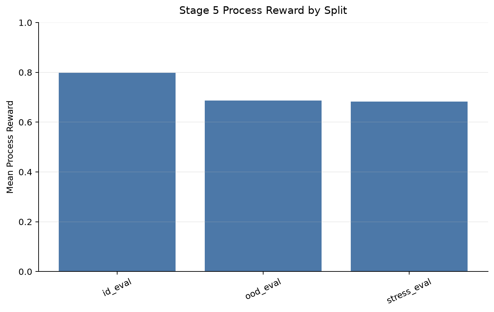
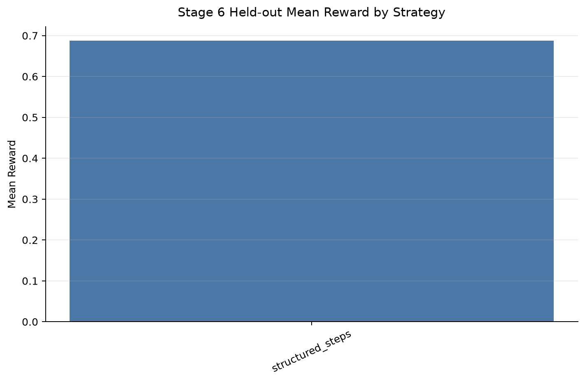
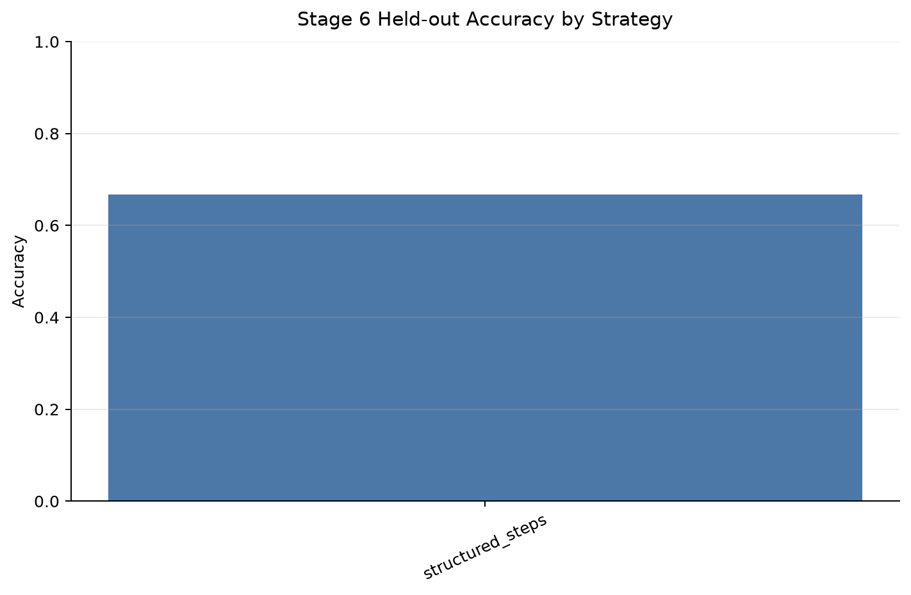
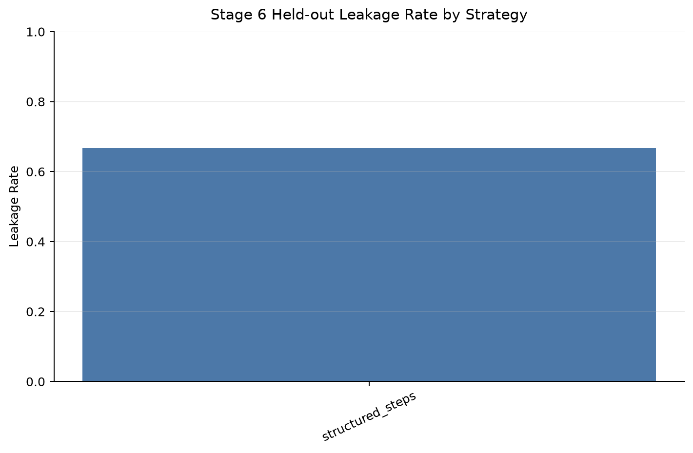
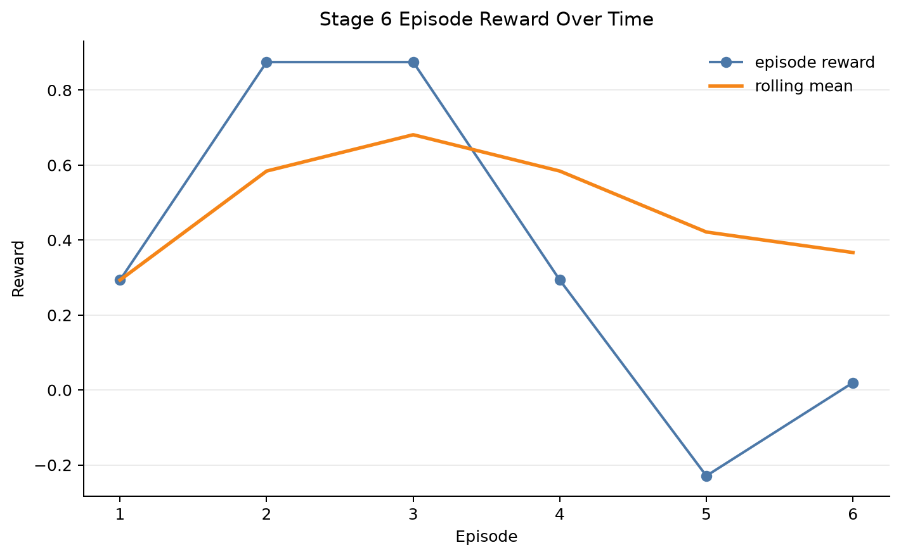
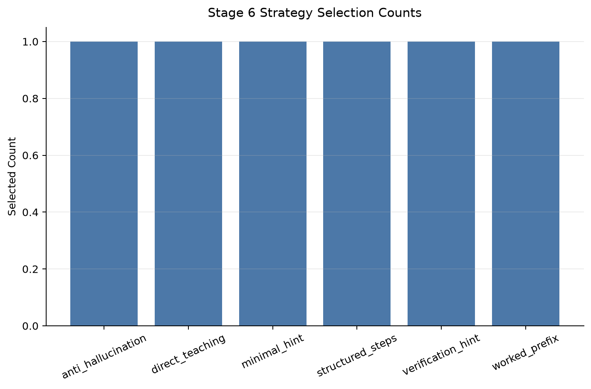

# TandemRLVR: Training Reasoning Agents to Remain Legible to Weaker Overseers

## Abstract

TandemRLVR investigates whether a stronger senior reasoning model can help a weaker junior model solve verifiable tasks through intermediate handoff reasoning. Stage 5 handoff gains by split were id_eval=0.100, ood_eval=0.100, stress_eval=-0.100. Stage 6 episode-best strategy was `structured_steps`, while heldout-best strategy was `structured_steps`. The current system is an empirical scaffold: it evaluates final-answer accuracy, process-level handoff quality, distribution shift, and a lightweight RLVR-style bandit over prompt strategies.

## Motivation

Scalable oversight depends on weaker overseers being able to inspect, continue, and verify the work of stronger systems. TandemRLVR studies this setting with a senior reasoning agent, a weaker junior agent, and verifiable tasks where final answers can be checked automatically.

## Research Question

Can a stronger senior model improve a weaker junior model's task performance by producing intermediate handoff reasoning that is useful, legible, and not merely answer leakage?

## Method

The pipeline evaluates senior-only, junior-only, clean tandem handoff, and corrupted handoff modes. It then scores handoff traces with transparent process metrics and uses a lightweight contextual bandit to choose among senior handoff prompt strategies. Stage 6 is not LLM fine-tuning; it is RLVR-style policy optimization over discrete handoff strategies.

## Task Environments

Tasks are synthetic and verifiable, covering arithmetic, list transformations, boolean logic, and code tracing. Stage 5 adds in-distribution, out-of-distribution, and stress splits to test whether handoff behavior survives distribution shift.

## Evaluation Modes

- `senior_only`: the senior model answers directly.
- `junior_only`: the junior model answers directly.
- `tandem_handoff`: the senior provides partial reasoning and the junior gives the scored answer.
- `corrupted_handoff`: the junior receives perturbed senior reasoning.

## Process Metrics

Process metrics estimate legibility, leakage, relevance, hallucination flags, and usefulness. These metrics are heuristic and transparent; they are intended as candidate reward signals rather than definitive measures of reasoning quality.

## Generalization Evaluation

Observed handoff gain by split: id_eval=0.100, ood_eval=0.100, stress_eval=-0.100.

Mean process reward by split: id_eval=0.799, ood_eval=0.687, stress_eval=0.683.

OOD generalization gap: 0.200.

Stress generalization gap: 0.300.







## RLVR-style Handoff Policy Optimization

Episode-best strategy: `structured_steps`.

Heldout-best strategy: `structured_steps`.

Heldout-best mean reward: 0.687.

Heldout-best accuracy: 0.667.

Heldout-best vs default deltas: accuracy=0.000, reward=0.000, process_reward=0.000.

Run-size warnings: Warning: this is a very small optimization run. Strategy rankings may be noisy.











## Results

Stage 5 reports accuracy by split and mode, making it possible to inspect when tandem handoff helps and when stress settings break handoff. Stage 6 separates episode-best strategy selection from held-out strategy evaluation, reducing the risk of overinterpreting noisy bandit episode rewards.

## Failure Analysis

Stage 5 failure counts by split: id_eval=13, ood_eval=24, stress_eval=25. Stage 6 tracks leakage by strategy, which is important because a high-reward handoff can be misleading if it reveals the final answer.

## Limitations

This project does not claim to train a frontier model. The tasks are synthetic, local LLM performance depends on the selected Ollama models, and the process reward is hand-designed. Stage 6 optimizes a bandit over prompt strategies, not neural model parameters. Small smoke runs should be treated as plumbing checks, not as stable empirical conclusions.

## Future Work

- Run larger Stage 5 and Stage 6 sweeps across seeds and model pairs.
- Compare bandit-selected handoff strategies against full RLVR fine-tuning baselines.
- Add human inspection or stronger automated judges for handoff legibility.
- Stress-test reward hacking, answer leakage, and hallucinated intermediate reasoning.

## Reproducibility

```bash
pytest
python -m tandem_rlvr.experiments.run_stage7_generate_report --outputs-dir outputs --report-dir reports
```
